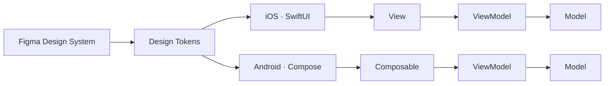

<div align="center">


<a href="https://nguyencaovu2007-design.github.io/vucaonguyeniosengineer/"></a>
<a href="mailto:nguyencaovu2007@gmail.com"></a>
<a href="https://github.com/karsirdev?tab=repositories"></a>


<br/><br/>

**Native-first. Design-system driven. Shipped, not just written.**

</div>

<br/>

```swift
// profile.swift
struct Engineer {
    let name       = "Vũ Cao Nguyên"
    let university = "PTIT — Software Engineering (Year 1)"
    let location   = "Ho Chi Minh City, Vietnam"
    let platforms  = ["iOS", "Android"]
    let mission    = "Build mobile apps people actually keep on their home screen."
    let status     = "Seeking Mobile Internship · iOS / Android"
}
```

<br/>

## ⚡ Tech Arsenal

<div align="center">


</div>

| Layer | Stack |
|:--|:--|
| **iOS** | Swift · SwiftUI · MVVM · Xcode |
| **Android** | Kotlin · Jetpack Compose · Material Design 3 · Android Studio |
| **Core CS** | C++ · OOP · Data Structures & Algorithms |
| **Design & Workflow** | Figma · Git · Conventional Commits |

<br/>

## 🚀 Flagship — SavingsBook

> A personal finance & savings tracker. One product, two native apps, one design language.

<table>
<tr>
<td width="50%" valign="top">

### 🍎 [SavingsBook-iOS](https://github.com/karsirdev/SavingsBook-iOS)
  

- Figma-first **dual-theme** system (Light / Dark)
- Custom **design-token** layer
- **MVVM** + feature-based folder structure
- Auth flow: `Welcome → Login → Register → OTP`
- Reusable components: `PrimaryButton`, `SBTextField`, `PasswordField`

</td>
<td width="50%" valign="top">

### 🤖 [SavingsBook-Android](https://github.com/karsirdev/SavingsBook-Android)
  

- **Material Design 3** with adaptive theming
- **MVVM** on Jetpack Compose
- Same UX as iOS, adapted to Android conventions
- `WelcomeScreen` ✓ · `LoginScreen` _(building)_
- Idiomatic Kotlin from day one

</td>
</tr>
</table>



<br/>

## 🧠 How I Build

| | |
|:--|:--|
| **Design before code** | Tokens and components first, screens second. |
| **Separation of concerns** | MVVM — views render state, ViewModels own logic. |
| **Platform-native** | Swift written like Swift, Kotlin written like Kotlin. |
| **Clean history** | Conventional Commits, `git pull --rebase`, reviewable diffs. |

<br/>

## 🗺️ Roadmap

```diff
+ Console projects shipped        banking_console_kotlin · SwiftOOP
+ SavingsBook design in Figma     dual-theme system
+ iOS auth flow                   Welcome → Login → OTP
+ Android project initialised     Material 3 + Compose
! Finish SavingsBook-iOS          in progress
- Release on the App Store
- Android ↔ iOS feature parity
- Mobile internship
```

<br/>

## 📊 Activity

<div align="center">


</div>

<br/>

<div align="center">

**Let's build something real.**
[nguyencaovu2007@gmail.com](mailto:nguyencaovu2007@gmail.com)


</div>
