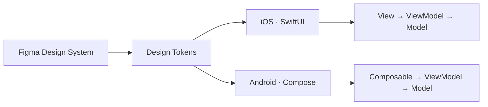

<div align="center">


<br/>

<a href="https://nguyencaovu2007-design.github.io/vucaonguyeniosengineer/"></a>
<a href="mailto:nguyencaovu2007@gmail.com"></a>
<a href="https://github.com/karsirdev?tab=repositories"></a>


</div>

<br/>

```swift
// profile.swift
struct Engineer {
    let name       = "Vũ Cao Nguyên"
    let university = "PTIT — Software Engineering (Year 2)"
    let location   = "Ho Chi Minh City, Vietnam"
    let craft      = ["iOS", "Android"]
    let security   = ["Cryptography", "Mobile Security"]
    let mission    = "Build native apps that are fast, beautiful — and secure by design."
    let status     = "Seeking Mobile Internship · iOS / Android"
}
```

## Tech Stack

<div align="center">


</div>

| Domain | Details |
|:--|:--|
| **iOS** | Swift · SwiftUI · MVVM |
| **Android** | Kotlin · Jetpack Compose · Material Design 3 |
| **Fundamentals** | C++ · OOP · Data Structures & Algorithms |
| **Design & Workflow** | Figma · Git · Conventional Commits |

## Featured Project — SavingsBook

> Personal finance & savings tracker. One product, two native apps, one design language.

<table>
<tr>
<td width="50%" valign="top">

### [SavingsBook-iOS](https://github.com/karsirdev/SavingsBook-iOS)
  

- Figma-first **dual-theme** system (Light / Dark)
- Custom **design-token** layer
- **MVVM**, feature-based structure
- Auth flow: `Welcome → Login → Register → OTP`
- Reusable `PrimaryButton`, `SBTextField`, `PasswordField`

</td>
<td width="50%" valign="top">

### [SavingsBook-Android](https://github.com/karsirdev/SavingsBook-Android)
  

- **Material Design 3**, adaptive theming
- **MVVM** on Jetpack Compose
- Same UX as iOS, adapted to Android conventions
- `WelcomeScreen` ✓ · `LoginScreen` _(building)_
- Idiomatic Kotlin from day one

</td>
</tr>
</table>



## Cybersecurity

Mobile apps handle real user data — especially finance apps. I'm building security knowledge alongside my mobile skills, starting from **cryptography** and moving toward application security.

<table>
<tr>
<td width="50%" valign="top">

**Learning track**
- Networking fundamentals
- Linux & command line
- Python for security
- Cryptography _(current focus)_
- Web & mobile application security

</td>
<td width="50%" valign="top">

**Lab & platforms**
- Kali Linux (ARM64, UTM)
- Burp Suite Community
- TryHackMe · PortSwigger Academy
- picoCTF

</td>
</tr>
</table>

**Cryptography in Swift & Kotlin:** AES-256-GCM · SHA-256 · HMAC · RSA · PBKDF2


## How I Build

| | |
|:--|:--|
| **Design before code** | Tokens and components first, screens second. |
| **Separation of concerns** | MVVM — views render state, ViewModels own logic. |
| **Platform-native** | Swift written like Swift, Kotlin written like Kotlin. |
| **Secure by default** | Treat user data and credentials as a first-class concern. |
| **Clean history** | Conventional Commits, `git pull --rebase`, reviewable diffs. |

## Roadmap

```diff
+ Console projects shipped         banking_console_kotlin · SwiftOOP
+ SavingsBook designed in Figma    dual-theme system
+ iOS auth flow                    Welcome → Login → OTP
+ Android project initialised      Material 3 + Compose
! Finish SavingsBook-iOS           in progress
! Cryptography fundamentals        in progress
- Release on the App Store
- Android ↔ iOS feature parity
- Mobile internship
```

<div align="center">


<br/>

**Let's build something real — and keep it secure.**
[nguyencaovu2007@gmail.com](mailto:nguyencaovu2007@gmail.com)

</div>
